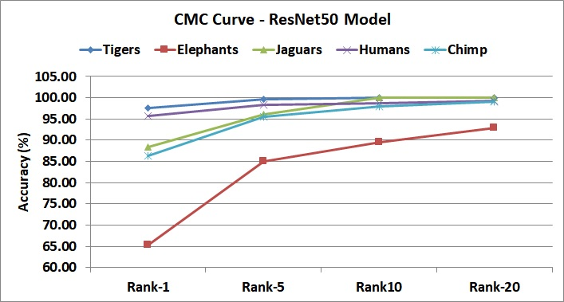

# Deep Learning Methods for Animal Re-Identification

Source code for Training and Evaluation of Animal Re-Identification using Deep Learning <br>
Forked from the Repository: [Bag of Tricks and A Strong Baseline for Deep Person Re-identification](https://github.com/michuanhaohao/reid-strong-baseline) <br>
<br>
<br>
DISCLAIMER: Code is free to use, but is not supported and wouldn't have active updates.

## Platform Information

Python 3 <br>
PyTorch 1.1.0 <br>

The code has been tested on Windows 8.1, with installation instructions as provided in the original repo. See README_org.md for install and dependency related information

## Datasets

A total of five new datasets are used in this code base.
* Tiger - Re-identification dataset obtained from the Amur Tiger Re-identification in the Wild [challenge](https://cvwc2019.github.io/challenge.html). Only the `plain-reid-train` data is used for the published results
* Elephants - The dataset of Elephants is obtained from [here](https://www.inf-cv.uni-jena.de/Research/Datasets/ELPephants.html)
* Jaguars - The dataset of Jaguars is obtained on request from [Prof. Marcelly Kelly](http://www.mjkelly.info/)
* Chimpanzees - The dataset is a combination of the CZoo and CTai datasets, information on both can be obtained this [Github repo](https://github.com/cvjena/chimpanzee_faces.git)
* FaceScrub - Assorted Celebrity faces dataset. Download the dataset [here](https://github.com/faceteam/facescrub)
<br>
For each dataset, the details of the training and test sets, and the splits used for gallery, query and train image names are included in this repository for reference, under the `data/image_sets` folder. <br>

### Creating the data in the required format

Since the dataset here requires a very specific folder structure and file naming convention, a few useful scripts are provided under the `scripts` folder for ease of use.<br><br>
Download the required datasets, and run the `create_open_reid_splits.py` script to seggregate the data into a `train` and `test` split, with 20% of the identities in the dataset and all corresponding images being moved into a test set.  The script expects that the folder pointed to contains a file called `normalized_class_mapping.txt` or `class_mapping.txt`, which has two entries per line, separated by a tab (`\t`) character. The first entry is the name of the image file (unqualified) and the second entry is an integer identifier for the individual in the image. Each image must have only a single individual. Datasets which do not provide cropped images need to be manually cropped. For Elephants and Jaguars, the bounding-box co-ordinates for each file, saved in PASCAL-VOC format are provided in this repository. <br>
An example of the `normalized_class_mapping.txt` file:

```
003597.jpg	250
003523.jpg	256
003900.jpg	171
002636.jpg	247
002249.jpg	238
...
```

Once the train and test split are generated, only the training data is used for further train steps. <br>

Once the train and test data are prepared, the `prepare_ds_for_training.py` script can be used to generate data as required for reid model training. The script creates an intermediate output folder containing a copy of the images renamed as per requirements, and generates 10 random splits of the dataset. You can specify a particular split number create the dataset. By default, split 0 will be used.<br>
<br>

```bash
# Download dataset, create normalized_class_mapping.txt and place in DATSET_HOME

# Create two folders - train and test, under $DATASET_HOME/train-test-splits
python3 scripts/create_open_reid_splits.py $DATASET_HOME $DATASET_HOME/train-test-splits

# Creates some intermediate data under $DATSET_HOME/intermediate_training_data and place the final output in $DATASET_HOME/reid-train-data
# Example for the Amur dataset, and provide split number as 6
python3 scripts/prepare_ds_for_training.py $DATASET_HOME/train-test-splits/train $DATASET_HOME/intermediate_training_data $DATASET_HOME/reid-train-data amur 6
```

<br>

For Chimpanzees, an additional utility script, `prepare_chimp_ds.py` is provided to create the initial train and test dataset splits.

```bash
python3 scripts/prepare_chimp_ds.py $CHIMP_DS_HOME/datasets_cropped_chimpanzee_faces $CHIMP_DS_HOME/intermediate_training_data $CHIMP_DS_HOME/reid-train-data

# Use the $CHIMP_DS_HOME/reid-train-data/train folder as input to the prepare_ds_for_training.py script
```

The final output would is expected to be in the following format:

```
- image_train
    # - <8 digit id>_<2 digit camera_number>_<4 digit image number>.jpg
    - 00000000_00_0016.jpg
    - 00000000_00_0017.jpg
    ...
    - 00000002_00_0000.jpg
    ...
- image_gallery
- image_query
```

Provide the path to this directory under the `DATASETS.ROOT_DIR` argument in the configuration file. For example, if the final output folder is placed under `$REPO_HOME/data/amur`, then set `DATSETS.ROOT_DIR: data` and `DATASETS.NAMES: amur` in the configuration file.

The following splits are used for each dataset to generate results reported in the paper:
* Amur - 6
* Elephants - 6
* Jaguar - 6
* FaceScrub - 6
* Chimp - 6 (and split number 0 of the original dataset)
<br>
A copy of the train and test list file names, along with those used for gallery, query and train are provided for verification. <br>

## Training the models

A simple batch file `train.bat` is included in the repo for quickly starting training. Several parameters may need to be altered before you can start the training. 
* Set the path to the ResNet50 and DenseNet201 pre-trained model paths in the `configs/*_softmax_triplet_with_center.yml` files. These are the weights auto-dowloaded by Torch, and are placed in the `.cache` folder. The location varies as per platform, but is generally found under `$TORCH_HOME/checkpoints`. More information can be found [here](https://pytorch.org/docs/stable/model_zoo.html#module-torch.utils.model_zoo)
* Set the `MODEL.NAME` parameter in the config file to `resnet50` or `densenet` as per requirements
* Other configurations, especially the number of the GPU device(s) can be specified either in the config file or from the command line
<br>

Launch training with `train configs\amur_softmax_triplet_with_center.yml` The training logs and checkpoints are saved under the `OUTPUT_DIR` folder, as specified in the config file.

## Evaluating the model

From the trained models, the best performing model is selected in terms of the validation mAP score. This is not necessarily the model generated by the last epoch of training. The best performing model (for example `resnet50_model_100.pth`) is used to measure the performance of the dataset over the test set. <br>
<br>
Both closed set re-identification, and open set re-identification are tested using the scripts `calc_closed_reid_acc.py` and `calc_true_open_reid_acc.py` respectively. Open Set Re-identification metric uses a different metric, and is described in detail in the paper.

```bash
# Closed Set ReId Accuracy, averaged over three random trials
python3 scripts/calc_closed_reid_acc.py $REPO_HOME/amur_test/resnet50_model_100.pth $DATASET_HOME/train-test-splits/test

# Open Set ReID Accuracy, averaged over three random trials
python3 scripts/calc_true_open_reid_acc.py $REPO_HOME/amur_test/resnet50_model_100.pth $DATASET_HOME/train-test-splits/train $DATASET_HOME/train-test-splits/test
```

## Results

The results of running the running the models over the validation and test sets are provided below. The trained model that performs best over the validation set (in terms of mAP) is used to evaluate performance over the test sets. <br>
<br>
A copy of the trained models can be obtained from this [Google Drive Link](https://drive.google.com/drive/folders/1LrHEnHKLB9CyShePTUdDD0yD9z1_zGEv?usp=sharing). The link also contains copies of the training and evaluation log files. <br>

### Validation Accuracy

#### ResNet50

| Name | mAP | Rank-1 | Rank-5 | Rank10 | Rank-20 |
| --- | --- | --- | --- | --- | --- |
| **Tigers** | 80.80 | 97.55 | 99.59 | 100.00 | 100.00 |
| **Elephants** | 41.20 | 65.36 | 84.97 | 89.54 | 92.81 |
| **Jaguars** | 69.48 | 88.46 | 96.15 | 100.00 | 100.00 |
| **FaceScrub** | 67.63 | 95.67 | 98.26 | 98.65 | 99.22 |
| **Chimp** | 44.23 | 86.32 | 95.6 | 97.99 | 99.12 |

#### DenseNet201

| Name | mAP | Rank-1 | Rank-5 | Rank10 | Rank-20 |
| --- | --- | --- | --- | --- | --- |
| **Tigers** | 80.54 | 96.68 | 98.75 | 99.17 | 99.58 |
| **Elephants** | 36.91 | 57.51 | 79.73 | 89.54 | 94.77 |
| **Jaguars** | 68.18 | 88.46 | 96.15 | 96.15 | 96.15 |
| **FaceScrub** | 42.69 | 84.13 | 92.67 | 94.65 | 96.35 |
| **Chimp** | 46.76 | 82.68 | 91.10 | 96.99 | 99.00 |

### Test Set Accuracy

#### ResNet50

*Closed Set Re-Id -- Mean and Standard Deviation over three random trials*

| Name | mAP | Rank-1 | Rank-5 | Rank10 | Rank-20 |
| --- | --- | --- | --- | --- | --- |
| **Tigers** | 89.59 | 99.64 ± 0.51 | 100.00 ± 0.00 | 100.00 ± 0.00 | 100.00 ± 0.00 |
| **Elephants** | 34.08 | 61.74 ± 3.95 | 81.16 ± 1.48 | 86.96 ± 3.09 | 92.46 ± 0.41 |
| **Jaguars** | 55.88 | 86.27 ± 9.09 | 97.06 ± 4.16 | 97.06 ± 4.16 | 97.06 ± 4.16 |
| **FaceScrub** | 66.71 | 95.80 ± 0.27 | 98.47 ± 0.17 | 99.11 ± 0.12 | 99.54 ± 0.08 |
| **Chimp** | 54.6 | 93.46 ± 0.92 | 99.14 ± 0.15 | 99.57 ± 0.15 | 100.00 ± 0.00 |


*Open Set Re-Id -- Mean and Standard Deviation over three random trials*

| Name | mAP | Rank-1 | Rank-5 | Rank10 | Rank-20 |
| --- | --- | --- | --- | --- | --- |
| **Tigers** | 86.47 | 95.29 ± 2.71 | 99.64 ± 0.51 | 100.00 ± 0.00 | 100.00 ± 0.00 |
| **Elephants** | 33.57 | 58.84 ± 6.04 | 79.13 ± 1.88 | 86.09 ± 0.71 | 92.46 ± 1.08 |
| **Jaguars** | 59.16 | 88.24 ± 2.40 | 100.00 ± 0.00 | 100.00 ± 0.00 | 100.00 ± 0.00 |
| **FaceScrub** | 63.96 | 89.83 ± 0.30 | 92.79 ± 0.43 | 93.81 ± 0.50 | 94.72 ± 0.42 |
| **Chimp** | 55.88 | 89.17 ± 1.09 | 98.39 ± 0.53 | 99.46 ± 0.30 | 99.89 ± 0.15 |

#### DenseNet201

*Closed Set Re-Id -- Mean and Standard Deviation over three random trials*

| Name | mAP | Rank-1 | Rank-5 | Rank10 | Rank-20 |
| --- | --- | --- | --- | --- | --- |
| **Tigers** | 90.26 | 100.00 ± 0.00 | 100.00 ± 0.00 | 100.00 ± 0.00 | 100.00 ± 0.00 |
| **Elephants* | 34.67 | 49.57 ± 3.76 | 80.87 ± 3.09 | 91.01 ± 2.17 | 97.10 ± 1.79 |
| **Jaguars** | 61.97 | 90.20 ± 3.67 | 99.02 ± 1.39 | 100 | 100 |
| **FaceScrub** | 45 | 85.87 ± 0.54 | 94.22 ± 0.27 | 96.26 ± 0.16 | 97.84 ± 0.16 |
| **Chimp** | 59.19 | 93.35 ± 0.4 | 99.04 ± 0.69 | 99.79 ± 0.3 | 100.00 ± 0.00 |

*Open Set Re-Id -- Mean and Standard Deviation over three random trials*

| Name | mAP | Rank-1 | Rank-5 | Rank10 | Rank-20 |
| --- | --- | --- | --- | --- | --- |
| **Tigers** | 88.82 | 97.10 ± 1.36 | 99.64 ± 0.51 | 100.00 ± 0.00 | 100.00 ± 0.00 |
| **Elephants** | 34.67 | 51.59 ± 5.14 | 81.74 ± 2.56 | 91.3 ± 1.23 | 97.39 ± 1.23 |
| **Jaguars** | 64.32 | 88.24 ± 2.4 | 100.00 ± 0.00 | 100.00 ± 0.00 | 100.00 ± 0.00 |
| **FaceScrub** | 44.12 | 80.95 ± 0.21 | 90.18 ± 0.32 | 92.87 ± 0.59 | 95.10 ± 0.74 |
| **Chimp** | 59.37 | 87.03 ± 2.64 | 95.18 ± 0.26 | 97.75 ± 0.79 | 99.25 ± 0.84 |

## Cumulative Matching Characterisitc (CMC) Curve



## Qualitative Results (using ResNet50 model)


